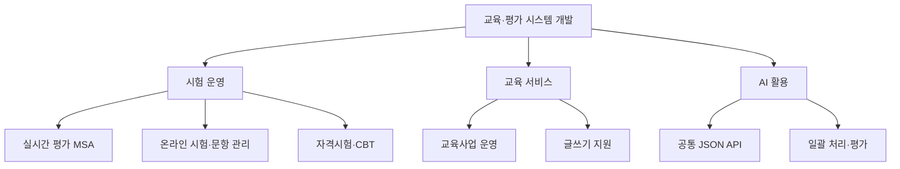

# IOSYS 프로젝트 포트폴리오

교육·평가 시스템에서 담당한 기능과 구현 과정을 프로젝트별로 정리하였습니다. Java 기반 시험·문항·교육사업 운영 기능을 개발·수정하였으며, 실시간 평가에서는 응시자 API와 메시지 워커의 데이터 흐름을 구성하였습니다. AI 과제에서는 공통 모델 호출 API와 입력 정제·일괄 평가를 구현하였습니다.

원본 코드와 변경 이력을 대조하여 담당 범위를 정리하고, 채용 담당자가 처리 방식까지 확인할 수 있도록 코드와 테스트를 연결하였습니다. 회사 원본은 공개하지 않고 업무 흐름을 독립적인 예제로 작성하였습니다.

## 프로젝트별 담당 업무

| 프로젝트 | 담당 범위 | 기술 | 상세 |
|---|---|---|---|
| 실시간 평가 플랫폼 | 공통 모델, 응시자 API, 인증·Gateway, 메시지 워커와 관리자 기능 | Java 17 · WebFlux · RabbitMQ · Redis · PostgreSQL | [저장소](https://github.com/jeon97/iosys_realtime_assessment_platform) |
| 온라인 시험·문항 관리 | 시험 결과·부정행위 통계, 검토계획, 선정위원 배정과 외부 API | Java · Spring MVC · MyBatis · JSP | [저장소](https://github.com/jeon97/iosys_online_test_platform) |
| 글쓰기 지원 플랫폼 | 기관 로그인·SSO, 세션, 접속·활동 로그와 콘텐츠 관리 | Java · Spring MVC · MyBatis · JSP | [저장소](https://github.com/jeon97/iosys_writing_center) |
| 자격시험 운영 시스템 | CBT 모니터링·채점, 시행결과, 출제계획과 전문가·설문 관리 | Java · Spring MVC · MyBatis/iBATIS · Nexacro | [저장소](https://github.com/jeon97/iosys_certification_test_system) |
| 교육사업 운영 시스템 | 모집·신청, 기관 운영, 예산 변경, 정산과 보고서 | Java · Spring MVC · MyBatis · JSP | [저장소](https://github.com/jeon97/iosys_education_business_operations_system) |
| 범용 AI API | FastAPI·Ollama 호출, 입력 정제, JSON 파싱·재시도와 일괄 평가 | Python · FastAPI · Ollama · SQLite | [저장소](https://github.com/jeon97/iosys_ai_api) |

## 대표 구현

### 실시간 평가의 저장 흐름 구성

응시자 요청의 중첩 답안 데이터와 JSON 형태의 시험 설정을 해석하도록 수정하였습니다. 워커에서는 Redis 반영 시도를 묶어 실행한 뒤 DB 저장으로 연결하도록 순서를 조정하였고, 최근 활동 로그를 개수 제한이 있는 목록으로 관리하였습니다.

### 시험 운영 데이터의 일괄 변경

문항 수의 몫·나머지로 위원별 연속 문항 구간을 배정하였습니다. 출제계획의 분야·유형·문항을 검토계획에 이관하는 기능을 다루었고, 채점 확정 취소 시 생성 성적을 삭제하고 응시 상태를 복구하도록 구성하였습니다.

### 기관별 정책과 운영 기록 처리

기관 설정에 따른 세션 유지시간, 관리자 로그 조회 권한과 조회 이력, 달력 연도 기준의 로그 삭제 조건을 처리하였습니다. 교육사업에서는 전체 모집 정원과 시험실 좌석 조건을 나누어 확인하고, 예산 변경 이력 조회와 보고서 출력 요청 기록을 구성하였습니다.

### AI 요청 처리와 중단 후 재실행

역할 지시문·입력·응답 필드 설명을 받는 API를 구현하였습니다. 모델 응답의 JSON 문법 오류는 제한된 횟수만 재시도하고, 일괄 처리에서는 저장된 결과 파일의 점수 열로 완료 행을 구분하여 미완료 행을 계속 처리하였습니다.

## 원본 기반 예제 24개

각 항목의 상세 문서에는 입력·처리 순서·결과·테스트와 공개 예제에서 보완한 규칙을 구분하였습니다. 기존 예제도 각 프로젝트 저장소에서 함께 확인할 수 있습니다.

| 프로젝트 | 추가 구현 사례 | 상세 |
|---|---|---|
| 실시간 평가 플랫폼 | 시험 설정 JSON의 이중 직렬화 처리 / 중첩 답안 요청에서 현재·이전 문항 분리 / 캐시 반영 시도 후 영속 저장 순서 구성 / 최신 활동 로그의 개수 제한과 만료 처리 | [처리 과정과 코드](https://github.com/jeon97/iosys_realtime_assessment_platform/blob/main/docs/CASE-STUDIES.md) |
| 온라인 시험·문항 관리 | 시험 정보·검색 건수·결과 목록 조합 / 위원 수에 따른 연속 문항 구간 배정 / 출제계획의 분야·유형·문항을 검토계획으로 이관 / 엑셀 문항번호로 검토 대상 재구성 | [처리 과정과 코드](https://github.com/jeon97/iosys_online_test_platform/blob/main/docs/CASE-STUDIES.md) |
| 글쓰기 지원 플랫폼 | 기관별 세션 유지시간 적용 / 로그인 활동에서 계정 식별 정보 추출 / 로그 조회 작업 자체의 권한 확인과 기록 / 달력 연도 기준의 로그 보존기간 계산 | [처리 과정과 코드](https://github.com/jeon97/iosys_writing_center/blob/main/docs/CASE-STUDIES.md) |
| 자격시험 운영 시스템 | 채점 확정 취소 시 관련 데이터 복구 / 대량 접수자 결과의 구간 분할 조회 / 이미 마감한 시험 결과의 재생성 차단 / 시험실 일괄 종료시간 변경의 시작 상태 확인 | [처리 과정과 코드](https://github.com/jeon97/iosys_certification_test_system/blob/main/docs/CASE-STUDIES.md) |
| 교육사업 운영 시스템 | 전체 모집 정원과 물리 좌석 조건 분리 / 예산 원안과 선택한 변경 이력의 상세 조회 / 정산 반려 안내와 승인 후 값 갱신 구분 / 보고서 미리보기와 출력 요청 이력 구분 | [처리 과정과 코드](https://github.com/jeon97/iosys_education_business_operations_system/blob/main/docs/CASE-STUDIES.md) |
| 범용 AI API | 업무별 설명을 받는 공통 응답 형식 구성 / JSON 문법 오류만 제한적으로 재시도 / 저장된 결과 행을 이용한 일괄 평가 재개 / 평가 데이터셋의 불필요한 행 제거 | [처리 과정과 코드](https://github.com/jeon97/iosys_ai_api/blob/main/docs/CASE-STUDIES.md) |

전체 코드 목록은 [구현 사례 목차](docs/EXAMPLE-CATALOG.md)에 정리하였습니다.

## 전체 업무 구성

## 확인 범위와 공개 기준

실시간 평가의 Git 변경은 파일별로 대조하였습니다. SVN 프로젝트는 본인 담당 설명·원본 구현·작업 사본 수정 정보를 대조하였으며, 마지막 수정자만으로 파일 전체의 단독 개발을 주장하지 않았습니다. AI는 보관 스크립트와 평가 보고서를 확인하였습니다.

공개 예제의 멱등성 저장소, 엄격한 스키마 검증, 체크포인트와 보안 정책에는 새로 보완한 설계가 포함됩니다. 해당 규칙을 재직 중 구현 사실로 혼동하지 않도록 각 저장소의 `docs/SOURCE-SCOPE.md`에 원본과의 차이를 명시하였습니다.

[프로젝트별 상세](docs/PROJECTS.md) · [공개 범위](docs/PUBLICATION-POLICY.md) · [공개 예제 검증](docs/VALIDATION.md)
