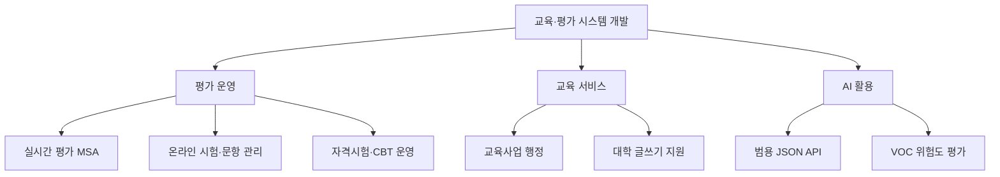

# IOSYS 프로젝트 포트폴리오

교육·평가 시스템을 개발하며 맡았던 업무를 프로젝트별로 정리한 포트폴리오입니다.

시험 운영, 문항 관리, 실시간 평가, 교육사업 행정과 AI API를 개발했습니다. 기능 구현에 그치지 않고 상태 전이, 중복 요청, 대량 처리, 운영 이력과 장애 상황까지 함께 고려했습니다.

## 프로젝트 한눈에 보기

| 프로젝트 | 담당 영역 | 주요 기술 | 상세 |
|---|---|---|---|
| 실시간 온라인 평가 운영 플랫폼 | 공통 모델, 응시자 API, 인증·Gateway, 이벤트 워커, 관리 기능 | Java 17, Spring WebFlux, RabbitMQ, Redis, PostgreSQL | [저장소](https://github.com/jeon97/iosys_realtime_assessment_platform) |
| 온라인 시험 및 문항 관리 플랫폼 | 시험 준비·응시·결과, 부정행위 통계, 검토계획, 선정위원 배정 | Java, Spring MVC, MyBatis, JSP | [저장소](https://github.com/jeon97/iosys_online_test_platform) |
| 자격시험 통합 운영 시스템 | CBT 모니터링, 채점·결과 확정, 출제계획, 설문, 전문가 인력풀 | Java, Spring MVC, Nexacro, MyBatis | [저장소](https://github.com/jeon97/iosys_certification_test_system) |
| 교육사업 통합 운영 시스템 | 모집·신청, 사업계획, 예산 변경, 보조금·정산, 워크숍 | Java, Spring MVC, MyBatis, JSP | [저장소](https://github.com/jeon97/iosys_education_business_operations_system) |
| 대학 글쓰기 지원 플랫폼 | 기관 로그인·SSO, 세션, 운영 로그, 게시판, 학사정보 연계 | Java, Spring MVC, MyBatis, JSP | [저장소](https://github.com/jeon97/iosys_writing_center) |
| 범용 sLLM JSON API | 공통 LLM API, 입력 정제, JSON 검증, 감사 로그, VOC 평가 | Python, FastAPI, Ollama, SQLite | [저장소](https://github.com/jeon97/iosys_ai_api) |

## 전체 업무 구조

## 개발할 때 중요하게 본 기준

### 업무 상태를 명확하게 관리

신청, 시험, 채점, 정산처럼 순서가 중요한 기능은 화면의 버튼 상태에만 의존하지 않았습니다. 서버에서 현재 상태를 다시 확인하고 허용된 전이만 반영하도록 구성했습니다.

### 중복 요청과 재실행에 대비

답안 제출, 결과 확정, 증명서 발급과 외부 전송은 같은 요청이 다시 들어올 수 있습니다. 요청 또는 이벤트 식별자를 기준으로 중복 반영을 막고, 이미 처리한 결과를 안전하게 반환하도록 구현했습니다.

### 실시간 처리와 영속 데이터를 분리

실시간 평가에서는 현재 접속 상태처럼 빠르게 조회할 데이터와 답안·감사 로그처럼 보존할 데이터를 분리했습니다. Redis, 메시지 큐와 관계형 데이터베이스의 역할을 나눠 요청 집중 시 부담과 장애 전파를 줄였습니다.

### 운영자가 복구할 수 있는 흐름 제공

대량 메일, 외부 API와 배치 작업은 일부 실패가 전체 작업을 중단하지 않도록 건별 결과를 분리했습니다. 실패 대상과 원인을 남기고 완료 건을 제외한 뒤 재실행할 수 있게 했습니다.

## 대표 구현 사례

| 주제 | 구현 사례 | 코드 |
|---|---|---|
| 이벤트 기반 저장 | 중복 이벤트 검사, 상태 갱신, 영속화 실패 처리 | [EventProcessor](https://github.com/jeon97/iosys_realtime_assessment_platform/blob/main/samples/event-worker/src/main/java/com/portfolio/assessment/eventworker/service/EventProcessor.java) |
| 실시간 감독 데이터 | 카메라·채팅·이상행위 이벤트의 최신 상태와 이력 분리 | [MonitoringEventService](https://github.com/jeon97/iosys_realtime_assessment_platform/blob/main/samples/event-worker/src/main/java/com/portfolio/assessment/eventworker/examinee/MonitoringEventService.java) |
| 시험 준비 | 시험정보, 정원, 좌석과 수험번호 중복 검증 | [ExamReadinessService](https://github.com/jeon97/iosys_online_test_platform/blob/main/samples/exam-workflow/src/main/java/com/portfolio/exam/readiness/ExamReadinessService.java) |
| 결과 확정 | 처리 ID 중복 확인과 전체 결과 검증 후 일괄 마감 | [ResultFinalizationService](https://github.com/jeon97/iosys_certification_test_system/blob/main/samples/exam-operations/src/main/java/com/portfolio/certification/result/ResultFinalizationService.java) |
| 예산 변경 | 세부금액 합계 검증, 상태 전이 제한과 변경 이력 | [BudgetChangeService](https://github.com/jeon97/iosys_education_business_operations_system/blob/main/samples/business-operations/src/main/java/com/portfolio/education/budget/BudgetChangeService.java) |
| 기관 SSO | 인증 만료, 이동 경로, 중복 세션 교체와 로그아웃 | [SsoSessionService](https://github.com/jeon97/iosys_writing_center/blob/main/samples/operations-core/src/main/java/com/portfolio/writing/auth/SsoSessionService.java) |
| LLM 응답 검증 | 입력 정제, 모델 제한, JSON 스키마 검증과 재시도 | [AiTaskService](https://github.com/jeon97/iosys_ai_api/blob/main/app/core.py) |

## 기술 범위

| 구분 | 경험 기술 |
|---|---|
| Backend | Java, Spring Boot, Spring MVC, Spring WebFlux, 전자정부표준프레임워크, Python, FastAPI |
| Data | PostgreSQL, Oracle, MariaDB/MySQL, Redis, SQLite, MyBatis, iBATIS, R2DBC |
| Messaging·Realtime | RabbitMQ, Reactor RabbitMQ, WebSocket, SSE |
| Frontend | React, TypeScript, JavaScript, JSP, Nexacro |
| Test·Operations | JUnit, Maven, Gradle, JMeter, Scouter, Docker |

## 저장소를 보는 순서

백엔드와 시스템 설계 역량은 [실시간 평가 플랫폼](https://github.com/jeon97/iosys_realtime_assessment_platform), 복잡한 업무 규칙은 [자격시험 시스템](https://github.com/jeon97/iosys_certification_test_system)과 [교육사업 운영 시스템](https://github.com/jeon97/iosys_education_business_operations_system), AI 활용 경험은 [범용 AI API](https://github.com/jeon97/iosys_ai_api)에서 확인할 수 있습니다.

프로젝트별 담당 범위와 공개 예제의 연결은 각 저장소의 `docs/FEATURE-MATRIX.md`에 정리했습니다. 전체 프로젝트의 기술적 연결은 [프로젝트별 상세](docs/PROJECTS.md), 공개 기준은 [공개 범위](docs/PUBLICATION-POLICY.md)에서 확인할 수 있습니다.

## 공개 범위

이 포트폴리오는 업무 산출물과 버전 관리 이력을 근거로 담당 기능을 정리했습니다. 회사 원본 코드, 고객사명, 개인정보, 운영 데이터, 내부 주소와 인증정보는 포함하지 않았습니다. 예제 코드는 실제 업무에서 다룬 처리 구조를 설명하기 위해 별도로 작성했습니다.
